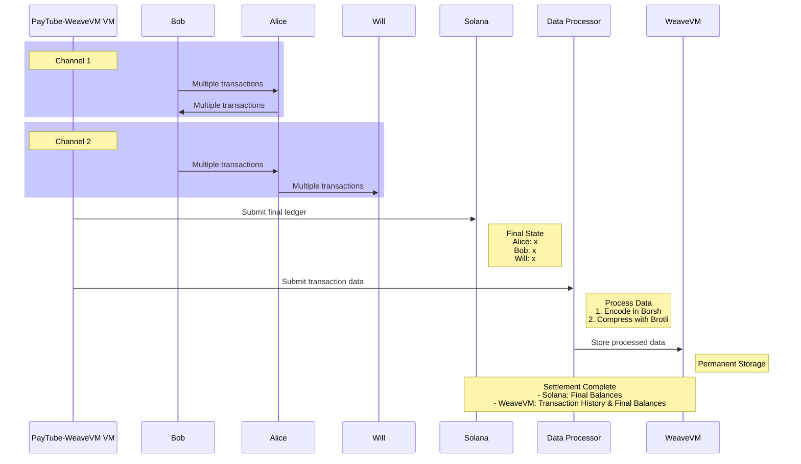

<p align="center">
  <a href="https://wvm.dev">
    
  </a>
</p>

## About
This repository is a customized fork of Agave's SVM [PayTube](https://github.com/anza-xyz/agave/tree/master/svm/examples/paytube) state channel (payment channel) that integrates [WeaveVM](https://wvm.dev) data settlement alongside Solana's. ***This repository is for educational purposes only***

## Build & Run

Before running the [native_sol](./tests/native_sol.rs) transfer test, ensure you have provided a WeaveVM-funded EOA in the `.env` file according to the `.env.example` format. You can obtain tWVM from the [WeaveVM faucet](https://wvm.dev/faucet).

```bash
git clone https://github.com/WeaveVM/wvm-svm.git

cd wvm-svm

cargo build && cargo test -- --nocapture
```

## PayTube-WeaveVM Architecture


## License
This repository is licensed under the [MIT License](./LICENSE)
